# Design Document

## Overview

The Intelligent Engineering Platform 2.0 represents a comprehensive transformation of the existing single-user AI-powered engineering application into an enterprise-grade collaborative platform. The design preserves and enhances all existing functionality while adding advanced AI automation, enterprise compliance capabilities, sophisticated collaboration tools, machine learning-driven insights, and seamless integrations with professional engineering software.

### Existing Features to Preserve and Enhance

The current application provides a solid foundation with the following core capabilities that must be maintained and enhanced:

**Current Project Lifecycle Management:**
- 7-phase engineering workflow (Requirements → Preliminary Design → Critical Design → Testing → Launch → Operation → Improvement)
- AI-powered document generation for each phase
- Tuning controls for AI generation parameters
- Phase-specific sprints and deliverables
- Design review workflows with checklists
- Progress tracking and completion status

**Current AI Integration:**
- Google Gemini API integration for content generation
- Context-aware document generation using previous phase outputs
- Customizable AI tuning parameters (clarity, technicality, foresight, etc.)
- Rapid vs. full development modes
- AI-generated design review checklists

**Current User Experience:**
- React-based responsive web interface
- Dark/light theme support
- Project wizard with discipline selection
- Real-time document editing and preview
- Markdown-based document format
- Export capabilities (individual documents and ZIP archives)

**Current Project Management:**
- Project templates and configuration
- Engineering discipline selection (20+ disciplines supported)
- Development mode selection (full vs. rapid prototyping)
- Project constraints and requirements management
- Local storage persistence

**Current Document System:**
- Phase-based document organization
- Sprint-level document generation
- Markdown rendering with syntax highlighting
- Document editing and regeneration capabilities
- Export to various formats

The platform architecture follows a microservices approach with event-driven communication, enabling scalability, maintainability, and independent deployment of features. The system is designed to handle everything from small individual projects to large enterprise engineering programs with thousands of users and complex multi-disciplinary workflows.

## Architecture

### High-Level System Architecture

```mermaid
graph TB
    subgraph "Client Layer"
        WEB[Web Application]
        MOBILE[Mobile Apps]
        API_CLIENTS[API Clients]
    end
    
    subgraph "API Gateway Layer"
        GATEWAY[API Gateway]
        AUTH[Authentication Service]
        RATE_LIMIT[Rate Limiting]
    end
    
    subgraph "Core Services"
        PROJECT[Project Service]
        COLLAB[Collaboration Service]
        TEMPLATE[Template Service]
        AI_CORE[AI Core Service]
        ANALYTICS[Analytics Service]
        NOTIFICATION[Notification Service]
    end
    
    subgraph "Advanced AI Services"
        RISK_ENGINE[Risk Engine]
        DESIGN_GEN[Design Generator]
        NLP_QUERY[NLP Query Service]
        BEST_PRACTICE[Best Practice Engine]
    end
    
    subgraph "Enterprise Services"
        COMPLIANCE[Compliance Tracker]
        AUDIT[Audit Service]
        VERSION[Version Control]
        ADMIN[Admin Service]
    end
    
    subgraph "Integration Layer"
        CAD_INT[CAD Integration]
        SIM_INT[Simulation Integration]
        EXT_INT[External Integrations]
    end
    
    subgraph "Collaboration Infrastructure"
        REALTIME[Real-time Engine]
        WHITEBOARD[Whiteboard Service]
        VIEWER_3D[3D Viewer Service]
        FILE_SYNC[File Sync Service]
    end
    
    subgraph "Data Layer"
        PRIMARY_DB[(Primary Database)]
        ANALYTICS_DB[(Analytics Database)]
        FILE_STORE[(File Storage)]
        CACHE[(Redis Cache)]
        SEARCH[(Search Engine)]
    end
    
    WEB --> GATEWAY
    MOBILE --> GATEWAY
    API_CLIENTS --> GATEWAY
    
    GATEWAY --> AUTH
    GATEWAY --> PROJECT
    GATEWAY --> COLLAB
    GATEWAY --> TEMPLATE
    
    PROJECT --> AI_CORE
    PROJECT --> ANALYTICS
    PROJECT --> NOTIFICATION
    
    AI_CORE --> RISK_ENGINE
    AI_CORE --> DESIGN_GEN
    AI_CORE --> NLP_QUERY
    AI_CORE --> BEST_PRACTICE
    
    PROJECT --> COMPLIANCE
    PROJECT --> AUDIT
    PROJECT --> VERSION
    
    COLLAB --> REALTIME
    COLLAB --> WHITEBOARD
    COLLAB --> VIEWER_3D
    COLLAB --> FILE_SYNC
    
    PROJECT --> CAD_INT
    PROJECT --> SIM_INT
    PROJECT --> EXT_INT
    
    PROJECT --> PRIMARY_DB
    ANALYTICS --> ANALYTICS_DB
    FILE_SYNC --> FILE_STORE
    REALTIME --> CACHE
    NLP_QUERY --> SEARCH
```



### Technology Stack

**Frontend (Enhanced from Existing):**
- React 18+ with TypeScript (preserving existing React/TypeScript codebase)
- Existing UI components enhanced: Button, Card, Badge, ProgressBar
- Preserving existing theme system (dark/light mode toggle)
- Maintaining current responsive design and layout structure
- Enhancing existing Markdown rendering with Remarkable
- Preserving Lucide React icon system
- React Native for new mobile applications
- WebRTC for real-time collaboration
- Three.js for 3D visualization
- WebGL for high-performance rendering
- Progressive Web App (PWA) capabilities

**Backend Services (Enhanced from Existing):**
- Node.js with TypeScript for core services (building on existing architecture)
- Preserving existing Google Gemini API integration patterns
- Maintaining current project data models and localStorage patterns
- Python for AI/ML services
- Go for high-performance services (file sync, real-time)
- GraphQL for flexible API queries
- REST APIs for standard operations
- WebSocket for real-time communication

**AI/ML Stack:**
- Google Gemini API for text generation and analysis
- TensorFlow/PyTorch for custom ML models
- OpenAI Embeddings for semantic search
- Hugging Face Transformers for NLP
- Custom risk prediction models
- Computer vision for design analysis

**Data Storage:**
- PostgreSQL for primary relational data
- MongoDB for document storage and templates
- ClickHouse for analytics and time-series data
- Redis for caching and session management
- Elasticsearch for full-text search
- MinIO/S3 for file storage

**Infrastructure:**
- Kubernetes for container orchestration
- Docker for containerization
- NGINX for load balancing
- Prometheus/Grafana for monitoring
- ELK Stack for logging
- HashiCorp Vault for secrets management

## Components and Interfaces

### Core Platform Components

#### 1. Project Management Core (Enhanced from Existing)
**Responsibilities:**
- Project lifecycle management (preserving existing 7-phase workflow)
- Phase and sprint orchestration (enhancing existing phase system)
- Task assignment and tracking (new collaborative features)
- Resource allocation (new enterprise features)
- Timeline management (enhanced analytics)

**Enhanced Existing Features:**
- Maintains current phase structure: Requirements, Preliminary Design, Critical Design, Testing, Launch, Operation, Improvement
- Preserves existing AI document generation for each phase
- Enhances current tuning controls with saved profiles
- Extends current design review system with collaborative approvals
- Maintains existing development modes (full vs. rapid)

**Key Interfaces:**
```typescript
interface ProjectService {
  // Existing functionality enhanced
  createProject(template: Template, config: ProjectConfig): Promise<Project>
  updateProject(projectId: string, updates: ProjectUpdate): Promise<Project>
  
  // Enhanced phase management
  generatePhaseDocument(phaseId: string, sprintId: string, tuningSettings: TuningSettings): Promise<Document>
  updateTuningSettings(phaseId: string, settings: TuningSettings): Promise<void>
  
  // New collaborative features
  assignTask(taskId: string, userId: string, role: DynamicRole): Promise<TaskAssignment>
  getProjectAnalytics(projectId: string): Promise<ProjectAnalytics>
  generateProjectReport(projectId: string, type: ReportType): Promise<Report>
  
  // Enhanced export capabilities
  exportProject(projectId: string, format: ExportFormat): Promise<ExportResult>
  generateVibePrompt(projectId: string, type: 'code' | 'simulation'): Promise<string>
}

interface Project {
  // Existing core structure preserved
  id: string
  name: string
  requirements: string
  constraints: string
  disciplines: string[]
  developmentMode: 'full' | 'rapid'
  currentPhase: number
  phases: Phase[]
  createdAt: Date
  
  // Enhanced with new collaborative features
  template: Template
  team: TeamMember[]
  dynamicRoles: DynamicRole[]
  complianceRequirements: ComplianceRequirement[]
  integrations: Integration[]
  updatedAt: Date
}

interface Phase {
  // Existing phase structure preserved
  id: string
  name: string
  description: string
  status: 'not-started' | 'in-progress' | 'in-review' | 'completed'
  sprints: Sprint[]
  tuningSettings: TuningSettings
  output?: string
  isEditable: boolean
  
  // Enhanced with new features
  designReview?: DesignReview
  assignedUsers: string[]
  collaborationSessions: CollaborationSession[]
  versionHistory: VersionHistory[]
}

interface Sprint {
  // Existing sprint structure preserved
  id: string
  name: string
  description: string
  status: 'not-started' | 'in-progress' | 'completed'
  deliverables: string[]
  output?: string
  
  // Enhanced with collaborative features
  assignedTo?: string
  assignedRole?: DynamicRole
  estimatedHours?: number
  actualHours?: number
  dependencies: string[]
}
```

#### 2. AI Core Engine (Enhanced from Existing Gemini Integration)
**Responsibilities:**
- Coordinate all AI-powered features (preserving existing Gemini API integration)
- Manage AI model lifecycle (enhancing existing prompt management)
- Handle prompt engineering and optimization (building on existing tuning controls)
- Provide unified AI API for other services (extending current AI capabilities)

**Enhanced Existing Features:**
- Preserves current Google Gemini API integration and prompt engineering
- Maintains existing tuning parameters (clarity, technicality, foresight, riskAversion, userCentricity, conciseness)
- Enhances existing context propagation between phases
- Extends current document generation with new AI capabilities
- Maintains existing development mode adaptations (full vs. rapid)

**Key Interfaces:**
```typescript
interface AIService {
  // Enhanced existing document generation
  generateContent(prompt: string, context: AIContext, tuningSettings: TuningSettings): Promise<AIResponse>
  generatePhaseDocument(phaseType: string, sprintType: string, projectContext: ProjectContext, tuningSettings: TuningSettings): Promise<string>
  generateDesignReviewChecklist(documentContent: string, phaseType: string, projectContext: ProjectContext): Promise<string[]>
  
  // New advanced AI features
  analyzeRisk(projectData: ProjectData): Promise<RiskAnalysis>
  generateDesign(requirements: Requirements): Promise<DesignSpecification>
  processNaturalLanguageQuery(query: string, context: ProjectContext): Promise<QueryResponse>
  recommendBestPractices(projectType: string, phase: string): Promise<BestPractice[]>
  
  // Enhanced export capabilities
  generateVibePrompt(projectData: ProjectData, type: 'code' | 'simulation'): Promise<string>
}

interface TuningSettings {
  // Existing tuning parameters preserved
  clarity?: number
  technicality?: number
  foresight?: number
  riskAversion?: number
  userCentricity?: number
  conciseness?: number
  
  // Phase-specific tuning (existing)
  creativity?: number
  costOptimization?: number
  performanceBias?: number
  modularity?: number
  
  // New advanced tuning options
  [key: string]: number | string | boolean | undefined
}

interface AIContext {
  // Existing context structure enhanced
  projectName: string
  disciplines: string[]
  requirements: string
  constraints: string
  developmentMode: 'full' | 'rapid'
  
  // Enhanced context from previous phases
  previousPhaseOutputs: PhaseOutput[]
  currentPhase: string
  sprintContext: string
  
  // New collaborative context
  teamContext: TeamContext
  organizationContext: OrganizationContext
}

interface RiskAnalysis {
  risks: Risk[]
  overallScore: number
  mitigationStrategies: MitigationStrategy[]
  confidenceLevel: number
}
```

#### 3. Template Generation System (Enhanced from Existing Project Wizard)
**Responsibilities:**
- AI-powered template creation (enhancing existing project creation)
- Dynamic role generation (new collaborative feature)
- Industry-specific customization (building on existing discipline selection)
- Template versioning and management (new enterprise feature)

**Enhanced Existing Features:**
- Preserves current project wizard workflow and discipline selection
- Maintains existing 20+ engineering disciplines support
- Enhances current project configuration with AI-generated templates
- Extends existing development mode selection with template-based options
- Preserves current tuning settings configuration per phase

**Key Interfaces:**
```typescript
interface TemplateService {
  // Enhanced existing project creation
  createProjectFromWizard(wizardData: ProjectWizardData): Promise<Project>
  getAvailableDisciplines(): Promise<EngineeringDiscipline[]>
  
  // New AI-powered template generation
  generateTemplate(config: TemplateConfig): Promise<Template>
  createDynamicRoles(disciplines: string[], scale: ProgramScale): Promise<DynamicRole[]>
  customizeForOrganization(template: Template, orgPrefs: OrgPreferences): Promise<Template>
  validateTemplate(template: Template): Promise<ValidationResult>
  
  // Enhanced template management
  saveCustomTemplate(project: Project, templateName: string): Promise<Template>
  getTemplateLibrary(): Promise<Template[]>
}

interface ProjectWizardData {
  // Existing wizard structure preserved
  name: string
  requirements: string
  constraints: string
  disciplines: string[]
  developmentMode: 'full' | 'rapid'
  
  // Enhanced with new options
  templateId?: string
  programScale: ProgramScale
  organizationPreferences?: OrganizationPreferences
}

interface Template {
  id: string
  name: string
  description: string
  version: string
  
  // Enhanced from existing project structure
  disciplines: string[]
  developmentMode: 'full' | 'rapid'
  phases: PhaseTemplate[]
  
  // New collaborative features
  dynamicRoles: DynamicRole[]
  complianceFrameworks: string[]
  aiProfiles: AIProfile[]
  integrationRequirements: IntegrationRequirement[]
  
  // Template metadata
  isBuiltIn: boolean
  isCustom: boolean
  organizationId?: string
  usage: TemplateUsage
  createdAt: Date
}

interface PhaseTemplate {
  // Based on existing phase structure
  name: string
  description: string
  sprints: SprintTemplate[]
  tuningSettings: TuningSettings
  designReview: DesignReviewTemplate
  
  // Enhanced with new features
  estimatedDuration: number
  requiredRoles: string[]
  deliverableTemplates: DeliverableTemplate[]
}
```

### Advanced AI Components

#### 4. Risk Prediction Engine
**Responsibilities:**
- Continuous project risk monitoring
- Predictive analytics for potential issues
- Mitigation strategy generation
- Risk trend analysis

**Key Interfaces:**
```typescript
interface RiskEngine {
  analyzeProjectRisks(projectId: string): Promise<RiskAssessment>
  predictFutureRisks(projectData: ProjectData, timeframe: number): Promise<RiskPrediction[]>
  generateMitigationPlan(risks: Risk[]): Promise<MitigationPlan>
  trackMitigationEffectiveness(planId: string): Promise<EffectivenessReport>
}

interface Risk {
  id: string
  type: RiskType
  probability: number
  impact: ImpactLevel
  description: string
  affectedAreas: string[]
  detectedAt: Date
  mitigationStrategies: MitigationStrategy[]
}
```

#### 5. Design Generation Service
**Responsibilities:**
- Automated design specification creation
- Technical drawing generation
- Design optimization and alternatives
- Compliance validation

**Key Interfaces:**
```typescript
interface DesignGenerator {
  generateDesignFromRequirements(requirements: Requirements): Promise<DesignSpecification>
  createDesignAlternatives(baseDesign: DesignSpecification, criteria: OptimizationCriteria): Promise<DesignAlternative[]>
  validateDesignCompliance(design: DesignSpecification, standards: ComplianceStandard[]): Promise<ComplianceValidation>
  optimizeDesign(design: DesignSpecification, objectives: OptimizationObjective[]): Promise<OptimizedDesign>
}

interface DesignSpecification {
  id: string
  requirements: Requirements
  specifications: TechnicalSpecification[]
  drawings: TechnicalDrawing[]
  calculations: DesignCalculation[]
  materials: MaterialSpecification[]
  complianceValidation: ComplianceValidation
  generatedAt: Date
}
```

#### 6. Natural Language Query Interface
**Responsibilities:**
- Natural language processing for project queries
- Contextual response generation
- Multi-modal data retrieval
- Query learning and optimization

**Key Interfaces:**
```typescript
interface NLPQueryService {
  processQuery(query: string, context: QueryContext): Promise<QueryResponse>
  generateVisualization(queryResult: QueryResult): Promise<Visualization>
  suggestRelatedQueries(query: string): Promise<string[]>
  learnFromInteraction(query: string, response: QueryResponse, feedback: UserFeedback): Promise<void>
}

interface QueryResponse {
  answer: string
  data: any[]
  visualizations: Visualization[]
  confidence: number
  sources: DataSource[]
  suggestedFollowUps: string[]
}
```

### Enterprise Components

#### 7. Compliance Management System
**Responsibilities:**
- Regulatory standard tracking
- Compliance gap analysis
- Automated compliance reporting
- Audit preparation

**Key Interfaces:**
```typescript
interface ComplianceService {
  trackCompliance(projectId: string, standards: ComplianceStandard[]): Promise<ComplianceStatus>
  generateComplianceReport(projectId: string, standard: string): Promise<ComplianceReport>
  identifyComplianceGaps(projectId: string): Promise<ComplianceGap[]>
  updateComplianceRequirements(standard: string, updates: ComplianceUpdate[]): Promise<void>
}

interface ComplianceStatus {
  projectId: string
  overallCompliance: number
  standardCompliance: StandardCompliance[]
  gaps: ComplianceGap[]
  recommendations: ComplianceRecommendation[]
  lastUpdated: Date
}
```

#### 8. Audit and Change Control
**Responsibilities:**
- Comprehensive audit trail maintenance
- Change control workflow management
- Digital signatures and approvals
- Forensic analysis capabilities

**Key Interfaces:**
```typescript
interface AuditService {
  logEvent(event: AuditEvent): Promise<void>
  generateAuditReport(criteria: AuditCriteria): Promise<AuditReport>
  searchAuditTrail(query: AuditQuery): Promise<AuditEvent[]>
  validateIntegrity(timeRange: TimeRange): Promise<IntegrityValidation>
}

interface AuditEvent {
  id: string
  timestamp: Date
  userId: string
  action: string
  resourceType: string
  resourceId: string
  changes: ChangeRecord[]
  signature: CryptographicSignature
  context: AuditContext
}
```

#### 9. Version Control System
**Responsibilities:**
- Design and document versioning
- Branch and merge operations
- Conflict resolution
- Version comparison and analysis

**Key Interfaces:**
```typescript
interface VersionControlService {
  createBranch(projectId: string, branchName: string, fromVersion?: string): Promise<Branch>
  mergeBranch(sourceBranch: string, targetBranch: string): Promise<MergeResult>
  compareVersions(version1: string, version2: string): Promise<VersionComparison>
  revertToVersion(projectId: string, version: string): Promise<RevertResult>
}

interface Branch {
  id: string
  name: string
  projectId: string
  parentVersion: string
  commits: Commit[]
  isActive: boolean
  createdBy: string
  createdAt: Date
}
```

### UI/UX Components (Enhanced from Existing)

#### Preserved and Enhanced Existing Components

**Core UI Components:**
- Enhanced Button component with new variants and collaborative features
- Extended Card component with real-time collaboration indicators
- Improved Badge component with status synchronization
- Enhanced ProgressBar with team progress visualization
- Preserved theme toggle functionality with organization branding options

**Existing Page Components Enhanced:**
- LandingPage: Enhanced with new feature showcases and enterprise signup
- ProjectWizard: Extended with template selection and team setup
- Dashboard: Enhanced with analytics, team management, and collaboration features
- PhaseView: Extended with real-time collaboration and advanced AI features
- DocumentsPage: Enhanced with new export formats and sharing capabilities

**Preserved Navigation and Layout:**
- Maintaining existing responsive design patterns
- Preserving current navigation structure with collaborative enhancements
- Extending existing modal and dialog systems
- Enhancing existing form components with validation and real-time sync

**Enhanced Existing Features:**
```typescript
// Enhanced existing components maintain backward compatibility
interface EnhancedButton extends ExistingButton {
  collaborationState?: CollaborationState
  permissions?: Permission[]
  realTimeSync?: boolean
}

interface EnhancedCard extends ExistingCard {
  collaborators?: Collaborator[]
  lastModified?: Date
  syncStatus?: SyncStatus
}

interface EnhancedPhaseView extends ExistingPhaseView {
  collaborationSession?: CollaborationSession
  realTimeEditing?: boolean
  versionControl?: VersionControlState
}
```

### Collaboration Components

#### 10. Real-time Collaboration Engine
**Responsibilities:**
- Multi-user real-time editing
- Conflict resolution
- Presence management
- Synchronization coordination

**Key Interfaces:**
```typescript
interface CollaborationService {
  joinSession(sessionId: string, userId: string): Promise<CollaborationSession>
  broadcastChange(sessionId: string, change: Change): Promise<void>
  resolveConflict(conflict: EditConflict): Promise<ConflictResolution>
  getActiveUsers(sessionId: string): Promise<ActiveUser[]>
}

interface CollaborationSession {
  id: string
  projectId: string
  documentId: string
  activeUsers: ActiveUser[]
  changes: Change[]
  conflictResolution: ConflictResolutionStrategy
  createdAt: Date
}
```

#### 11. 3D Visualization and Collaboration
**Responsibilities:**
- 3D model rendering and manipulation
- Multi-user 3D collaboration
- Annotation and markup tools
- Cross-platform 3D viewing

**Key Interfaces:**
```typescript
interface Viewer3DService {
  loadModel(modelId: string, format: ModelFormat): Promise<Model3D>
  createAnnotation(modelId: string, annotation: Annotation3D): Promise<string>
  shareViewpoint(sessionId: string, viewpoint: Viewpoint3D): Promise<void>
  measureDistance(point1: Point3D, point2: Point3D): Promise<Measurement>
}

interface Model3D {
  id: string
  format: ModelFormat
  geometry: Geometry3D
  materials: Material3D[]
  annotations: Annotation3D[]
  metadata: ModelMetadata
  boundingBox: BoundingBox3D
}
```

#### 12. Digital Whiteboard System
**Responsibilities:**
- Interactive whiteboard functionality
- Real-time collaborative drawing
- Template and shape libraries
- Integration with project data

**Key Interfaces:**
```typescript
interface WhiteboardService {
  createWhiteboard(projectId: string, template?: WhiteboardTemplate): Promise<Whiteboard>
  addElement(whiteboardId: string, element: WhiteboardElement): Promise<string>
  updateElement(elementId: string, updates: ElementUpdate): Promise<void>
  exportWhiteboard(whiteboardId: string, format: ExportFormat): Promise<ExportResult>
}

interface Whiteboard {
  id: string
  projectId: string
  elements: WhiteboardElement[]
  collaborators: Collaborator[]
  template: WhiteboardTemplate
  dimensions: Dimensions2D
  createdAt: Date
}
```

### Integration Components

#### 13. CAD Software Integration
**Responsibilities:**
- Bidirectional CAD file synchronization
- Design data extraction and analysis
- Automated workflow triggers
- Multi-CAD platform support

**Key Interfaces:**
```typescript
interface CADIntegration {
  connectCADSoftware(software: CADSoftware, credentials: CADCredentials): Promise<CADConnection>
  syncDesignFiles(connectionId: string, projectId: string): Promise<SyncResult>
  extractDesignData(fileId: string): Promise<DesignData>
  pushRequirements(connectionId: string, requirements: Requirements): Promise<void>
}

interface CADConnection {
  id: string
  software: CADSoftware
  projectId: string
  syncedFiles: CADFile[]
  lastSync: Date
  status: ConnectionStatus
  configuration: CADConfiguration
}
```

#### 14. Simulation Software Integration
**Responsibilities:**
- Automated simulation workflow management
- Results import and visualization
- Parameter synchronization
- Multi-physics simulation support

**Key Interfaces:**
```typescript
interface SimulationIntegration {
  connectSimulationSoftware(software: SimulationSoftware, config: SimulationConfig): Promise<SimulationConnection>
  runSimulation(connectionId: string, parameters: SimulationParameters): Promise<SimulationJob>
  importResults(jobId: string): Promise<SimulationResults>
  visualizeResults(results: SimulationResults): Promise<ResultVisualization>
}

interface SimulationResults {
  jobId: string
  software: SimulationSoftware
  parameters: SimulationParameters
  results: ResultData[]
  visualizations: ResultVisualization[]
  metadata: SimulationMetadata
  completedAt: Date
}
```

## Data Models

### Core Data Models

#### Project Data Model (Enhanced from Existing)
```typescript
interface Project {
  // Existing core structure preserved
  id: string
  name: string
  requirements: string
  constraints: string
  disciplines: string[]
  developmentMode: 'full' | 'rapid'
  currentPhase: number
  phases: Phase[]
  createdAt: Date
  
  // Enhanced with new collaborative features
  description?: string
  organizationId?: string
  templateId?: string
  template?: Template
  programScale?: ProgramScale
  
  // Team and Roles (new)
  team: TeamMember[]
  dynamicRoles: DynamicRole[]
  programLeader?: string
  
  // Compliance and Standards (new)
  complianceRequirements: ComplianceRequirement[]
  auditTrail: AuditEvent[]
  
  // Integrations (new)
  integrations: Integration[]
  cadConnections: CADConnection[]
  simulationConnections: SimulationConnection[]
  
  // Analytics and Tracking (new)
  analytics?: ProjectAnalytics
  riskAssessment?: RiskAssessment
  
  // Enhanced metadata
  updatedAt: Date
  createdBy?: string
  status: ProjectStatus
}

interface Phase {
  // Existing phase structure preserved exactly
  id: string
  name: string
  description: string
  status: 'not-started' | 'in-progress' | 'in-review' | 'completed'
  sprints: Sprint[]
  tuningSettings: TuningSettings
  output?: string
  isEditable: boolean
  designReview?: {
    required: boolean
    checklist: DesignReviewChecklistItem[]
  }
  
  // Enhanced with collaborative features
  assignedUsers?: string[]
  collaborationSessions?: CollaborationSession[]
  versionHistory?: VersionHistory[]
}

interface Sprint {
  // Existing sprint structure preserved exactly
  id: string
  name: string
  description: string
  status: 'not-started' | 'in-progress' | 'completed'
  deliverables: string[]
  output?: string
  
  // Enhanced with collaborative features
  assignedTo?: string
  assignedRole?: DynamicRole
  estimatedHours?: number
  actualHours?: number
  dependencies?: string[]
}

interface TuningSettings {
  // Existing tuning parameters preserved exactly
  [key: string]: number | string | boolean
  
  // Common existing settings
  clarity?: number
  technicality?: number
  foresight?: number
  riskAversion?: number
  userCentricity?: number
  conciseness?: number
  
  // Phase-specific existing settings
  creativity?: number
  costOptimization?: number
  performanceBias?: number
  modularity?: number
  technicalDepth?: number
  failureAnalysis?: number
  manufacturability?: number
  standardsAdherence?: number
}
```

#### Dynamic Role Model
```typescript
interface DynamicRole {
  id: string
  name: string
  description: string
  
  // Role Definition
  responsibilities: string[]
  deliverables: string[]
  approvalAuthorities: ApprovalAuthority[]
  
  // Permissions
  permissions: Permission[]
  accessLevel: AccessLevel
  
  // Context
  discipline: string
  projectScale: ProgramScale
  organizationContext: OrganizationContext
  
  // Relationships
  reportsTo: string[]
  manages: string[]
  collaboratesWith: string[]
  
  // Generated Metadata
  generatedBy: 'template' | 'ai' | 'manual'
  templateSource: string
  aiConfidence: number
  
  createdAt: Date
  updatedAt: Date
}
```

#### Template Model
```typescript
interface Template {
  id: string
  name: string
  description: string
  version: string
  
  // Template Configuration
  disciplines: string[]
  programScales: ProgramScale[]
  projectTypes: ProjectType[]
  
  // Structure Definition
  phases: PhaseTemplate[]
  dynamicRoles: DynamicRoleTemplate[]
  workflows: WorkflowTemplate[]
  
  // AI Configuration
  aiProfiles: AIProfile[]
  promptTemplates: PromptTemplate[]
  
  // Compliance and Standards
  complianceFrameworks: ComplianceFramework[]
  industryStandards: IndustryStandard[]
  
  // Integration Requirements
  requiredIntegrations: IntegrationRequirement[]
  recommendedIntegrations: IntegrationRequirement[]
  
  // Customization
  customizationOptions: CustomizationOption[]
  organizationAdaptations: OrganizationAdaptation[]
  
  // Metadata
  createdBy: string
  createdAt: Date
  updatedAt: Date
  usage: TemplateUsage
  rating: number
  isPublic: boolean
}
```

### Advanced AI Data Models

#### Risk Assessment Model
```typescript
interface RiskAssessment {
  projectId: string
  overallRiskScore: number
  riskLevel: RiskLevel
  
  // Individual Risks
  risks: Risk[]
  mitigationPlans: MitigationPlan[]
  
  // Predictions
  futureRisks: RiskPrediction[]
  trendAnalysis: RiskTrend[]
  
  // Recommendations
  recommendations: RiskRecommendation[]
  bestPractices: BestPractice[]
  
  // Metadata
  assessmentDate: Date
  confidence: number
  modelVersion: string
  dataQuality: DataQualityMetrics
}

interface Risk {
  id: string
  type: RiskType
  category: RiskCategory
  
  // Risk Characteristics
  probability: number // 0-1
  impact: ImpactLevel
  severity: RiskSeverity
  
  // Description and Context
  title: string
  description: string
  affectedAreas: string[]
  rootCauses: string[]
  
  // Timeline
  detectedAt: Date
  estimatedOccurrence: Date
  duration: number
  
  // Mitigation
  mitigationStrategies: MitigationStrategy[]
  currentStatus: RiskStatus
  
  // Tracking
  owner: string
  reviewDate: Date
  escalationLevel: EscalationLevel
}
```

#### Design Specification Model
```typescript
interface DesignSpecification {
  id: string
  projectId: string
  version: string
  
  // Source Requirements
  sourceRequirements: Requirements
  designObjectives: DesignObjective[]
  constraints: DesignConstraint[]
  
  // Generated Design
  specifications: TechnicalSpecification[]
  drawings: TechnicalDrawing[]
  calculations: DesignCalculation[]
  
  // Materials and Components
  materials: MaterialSpecification[]
  components: ComponentSpecification[]
  assemblies: AssemblySpecification[]
  
  // Analysis and Validation
  analysisResults: AnalysisResult[]
  validationTests: ValidationTest[]
  complianceValidation: ComplianceValidation
  
  // Alternatives and Optimization
  alternatives: DesignAlternative[]
  optimizationResults: OptimizationResult[]
  tradeStudy: TradeStudyResult
  
  // AI Generation Metadata
  generationMethod: GenerationMethod
  aiModel: string
  confidence: number
  reviewStatus: ReviewStatus
  
  // Lifecycle
  createdAt: Date
  updatedAt: Date
  approvedAt: Date
  approvedBy: string
}
```

### Collaboration Data Models

#### Collaboration Session Model
```typescript
interface CollaborationSession {
  id: string
  projectId: string
  documentId: string
  sessionType: SessionType
  
  // Participants
  activeUsers: ActiveUser[]
  invitedUsers: string[]
  permissions: SessionPermission[]
  
  // Content and Changes
  document: Document
  changes: Change[]
  conflicts: EditConflict[]
  
  // Real-time State
  cursors: CursorPosition[]
  selections: Selection[]
  annotations: Annotation[]
  
  // Session Management
  startedAt: Date
  lastActivity: Date
  isActive: boolean
  maxParticipants: number
  
  // Recording and History
  recordingEnabled: boolean
  changeHistory: ChangeHistory[]
  snapshots: SessionSnapshot[]
}

interface Change {
  id: string
  sessionId: string
  userId: string
  
  // Change Details
  type: ChangeType
  operation: Operation
  path: string
  oldValue: any
  newValue: any
  
  // Timing and Ordering
  timestamp: Date
  sequenceNumber: number
  dependencies: string[]
  
  // Conflict Resolution
  conflictsWith: string[]
  resolution: ConflictResolution
  
  // Metadata
  clientId: string
  deviceInfo: DeviceInfo
  networkLatency: number
}
```

## Error Handling

### Error Classification System

The platform implements a comprehensive error handling strategy with categorized error types:

#### 1. System Errors
- **Infrastructure Failures**: Database connectivity, service unavailability
- **Performance Issues**: Timeout errors, resource exhaustion
- **Security Violations**: Authentication failures, authorization denials

#### 2. Business Logic Errors
- **Validation Errors**: Invalid input data, constraint violations
- **Workflow Errors**: Invalid state transitions, missing prerequisites
- **Integration Errors**: External service failures, data synchronization issues

#### 3. AI/ML Errors
- **Model Failures**: AI service unavailability, model inference errors
- **Data Quality Issues**: Insufficient training data, bias detection
- **Confidence Thresholds**: Low confidence predictions, uncertainty handling

### Error Handling Strategies

#### Graceful Degradation
```typescript
interface ErrorHandlingStrategy {
  // Fallback Mechanisms
  fallbackToCache: boolean
  fallbackToSimpleMode: boolean
  fallbackToManualProcess: boolean
  
  // Retry Logic
  retryAttempts: number
  retryBackoff: BackoffStrategy
  circuitBreakerThreshold: number
  
  // User Experience
  showProgressIndicators: boolean
  provideAlternatives: boolean
  enableOfflineMode: boolean
  
  // Recovery Actions
  autoRecoveryEnabled: boolean
  manualRecoverySteps: RecoveryStep[]
  escalationProcedure: EscalationProcedure
}
```

#### AI Error Handling
```typescript
interface AIErrorHandler {
  handleModelFailure(error: ModelError): Promise<AIFallbackResponse>
  handleLowConfidence(prediction: AIPrediction): Promise<ConfidenceHandlingResult>
  handleBiasDetection(bias: BiasDetection): Promise<BiasHandlingResult>
  handleDataQualityIssues(issues: DataQualityIssue[]): Promise<QualityHandlingResult>
}
```

## Testing Strategy

### Multi-Layer Testing Approach

#### 1. Unit Testing
- **Service Layer Testing**: Individual microservice functionality
- **AI Model Testing**: Model accuracy, bias detection, performance
- **Integration Testing**: API contract validation, data flow verification

#### 2. Integration Testing
- **Service Integration**: Inter-service communication validation
- **External Integration**: CAD/Simulation software connectivity
- **Real-time Collaboration**: Multi-user scenario testing

#### 3. End-to-End Testing
- **User Journey Testing**: Complete workflow validation
- **Performance Testing**: Load testing, stress testing, scalability
- **Security Testing**: Penetration testing, vulnerability assessment

#### 4. AI/ML Testing
- **Model Validation**: Accuracy metrics, bias testing, fairness evaluation
- **Data Pipeline Testing**: Data quality, transformation accuracy
- **Prediction Testing**: Confidence intervals, edge case handling

### Testing Infrastructure

#### Automated Testing Pipeline
```typescript
interface TestingPipeline {
  // Test Execution
  unitTests: TestSuite[]
  integrationTests: TestSuite[]
  e2eTests: TestSuite[]
  performanceTests: TestSuite[]
  
  // AI/ML Testing
  modelValidation: ModelValidationSuite
  dataQualityTests: DataQualityTestSuite
  biasDetection: BiasDetectionSuite
  
  // Environment Management
  testEnvironments: TestEnvironment[]
  dataSeeding: DataSeedingStrategy
  mockServices: MockServiceConfiguration[]
  
  // Reporting and Analytics
  testReporting: TestReportingConfig
  metricsCollection: TestMetricsConfig
  failureAnalysis: FailureAnalysisConfig
}
```

#### Performance Testing Strategy
```typescript
interface PerformanceTestingStrategy {
  // Load Testing
  normalLoad: LoadTestConfig
  peakLoad: LoadTestConfig
  stressLoad: LoadTestConfig
  
  // Scalability Testing
  horizontalScaling: ScalingTestConfig
  verticalScaling: ScalingTestConfig
  autoScaling: AutoScalingTestConfig
  
  // Real-time Performance
  collaborationLatency: LatencyTestConfig
  aiResponseTime: ResponseTimeTestConfig
  fileSync: FileSyncTestConfig
  
  // Resource Utilization
  memoryUsage: ResourceTestConfig
  cpuUtilization: ResourceTestConfig
  networkBandwidth: BandwidthTestConfig
}
```

This comprehensive design document provides the foundation for implementing the Intelligent Engineering Platform 2.0 with all the advanced features specified in the requirements. The architecture is designed for scalability, maintainability, and extensibility while ensuring enterprise-grade security and compliance capabilities.